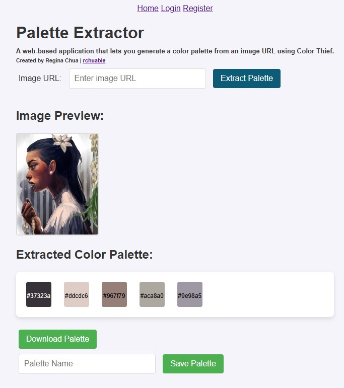

# PALETTE EXTRACTOR
#### Video Demo:  <URL HERE>
#### Description:
Palette Extractor is a web-based application that extracts a palette--containing up to five dominant colors--from any image URL. This application is built with Flask and uses the Color Thief libraray. Hex codes accompany the palette for reference.

Created to complete https://cs50.harvard.edu/x/2024/project/



## Author's (or Artist's) Note
I built this app so that I could link reference images which had colors that I liked. The palette extractor helps me build gradient maps for digital art so it's easier to adjust the tones and hues of an illustration. I hope that this simple tool will help other artists and designers.

## Features
- Accepts image URLs as input
- Generates a color palette (2-5 colors)
- Displays hex codes for each color
- Simple and clean UI
- Option to download the palette as an image
- Save and view palettes with a free account

## Technologies Used
- Flask: Web framework
- Color Thief: Extracts dominant colors
- HTML/CSS: Front-end styling

## Setup
### Prerequisites
- Python 3.7+
- pip

### Installation
1. Clone the repository:
```
git clone https://github.com/rchuable/palette.git
cd palette
```
2. Create a virtual environment:
`python -m venv venv`
3. Activate the virual environment
- On Windows: `venv\Scripts\activate` or `./venv/Scripts/activate`
- On macOS/Linux: `source venv/bin/activate`
4. Install dependencies:
`pip install -r requirements.txt`
5. Set up the database:
```
flask db init
flask db migrate -m "Initial migration."
flask db upgrade
```
6. Run the application:
`flask run`
7. Open the application in your browser:
Go to `http://127.0.0.1:5000`

## License
This project is licensed under the MIT License. See LICENSE for more information.